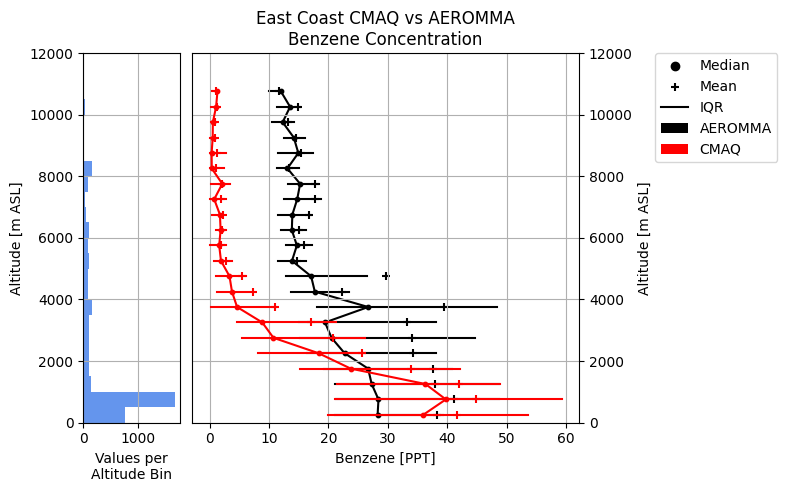
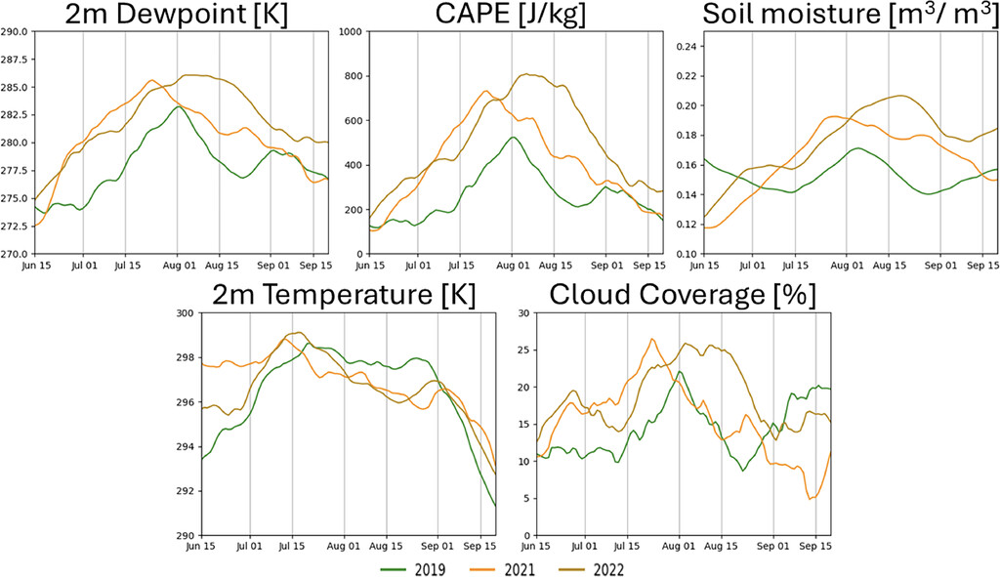
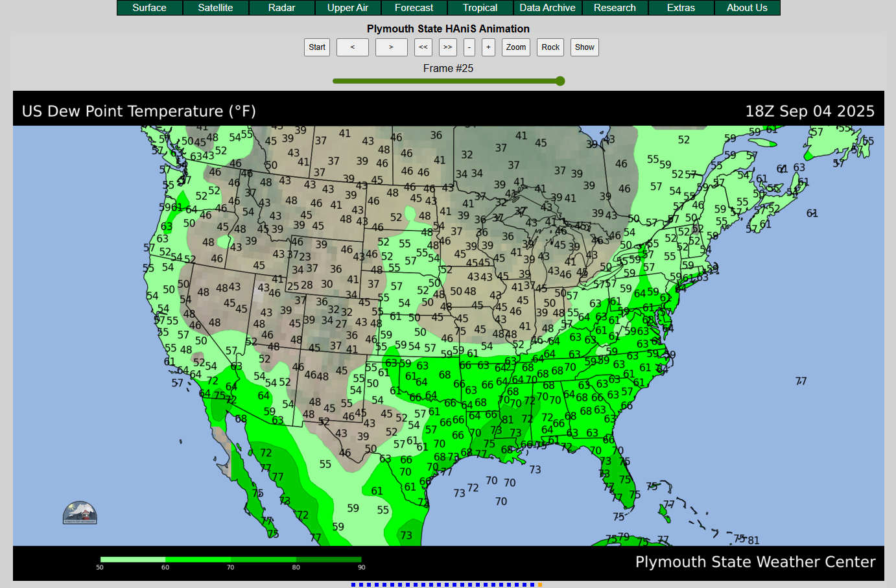
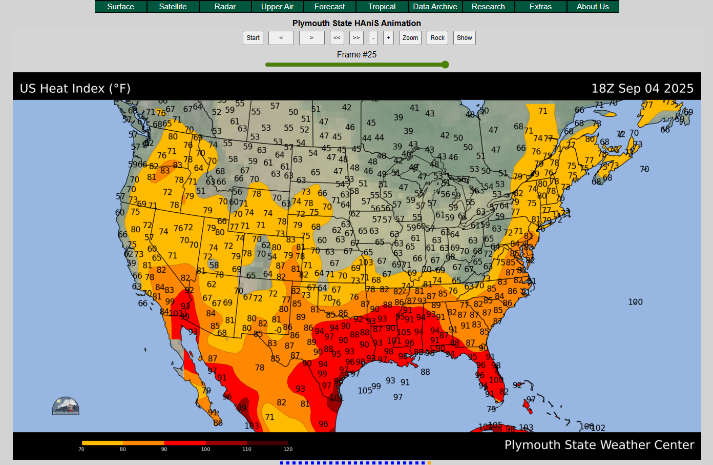
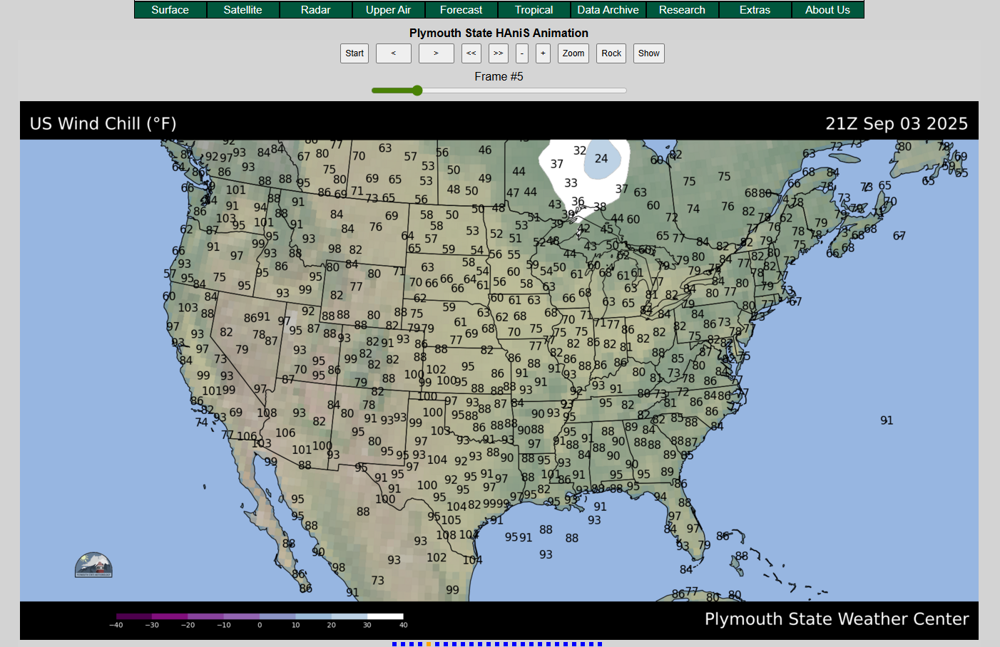
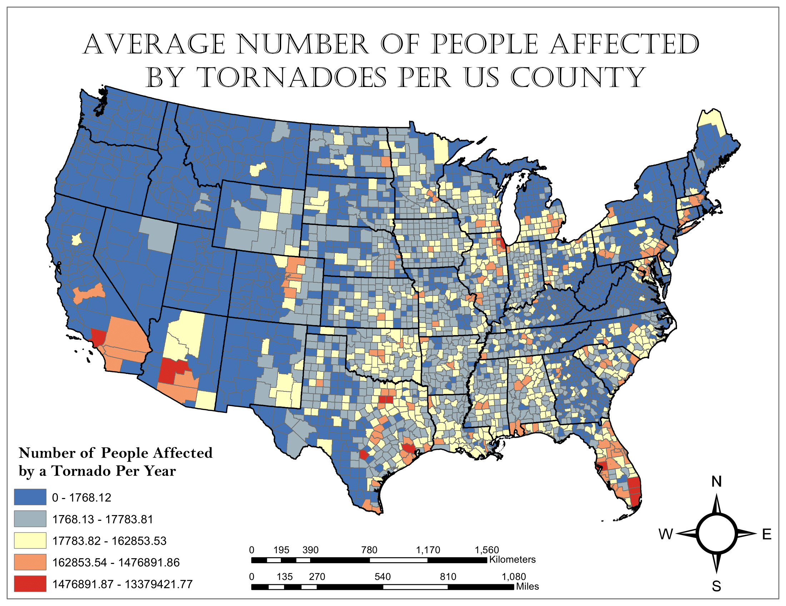
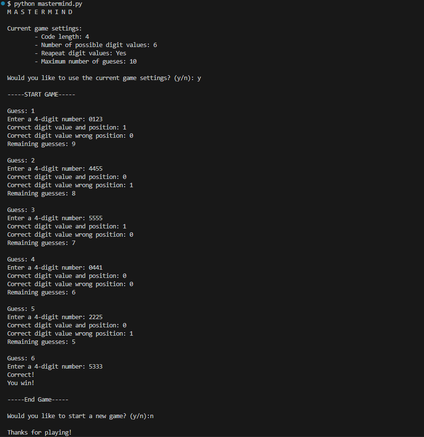

# **Projects**

---

# **Data Analysis Packages**

## **CMAQ-FlightEval**

Click [here](https://github.com/Applepye21/CMAQ-FlightEval) to visit the CMAQ-FlightEval GitHub repository.

During my time as a contractor at the [Environmental Protection Agency](https://www.epa.gov/), I developed the CMAQ-FlightEval tool. The tool is composed of a group of Jupyter Notebooks designed to match aircraft observations of atmospheric conditions to forecasts from the [Community Multiscale Air Quality (CMAQ) modeling system](https://usepa.github.io/CMAQ/). In other words, for a series of observations along a given flight path, CMAQ-FlightEval finds the corresponding CMAQ forecast at the same time, latitude, longitude, and altitude as each observation in the series. It then produces a [Pandas](https://pandas.pydata.org/docs/) data frame that contains a series of CMAQ forecasts that corresponds to the series of aircraft observations.

The purpose of this Python tool is to make aircraft observations easily usable when assessing the performance of CMAQ forecasts. With the code available, CMAQ-FlightEval is primarily set up to handle observations from the [AEROMMA field campaign](https://csl.noaa.gov/projects/aeromma/), as this was the dataset I was using for my CMAQ performance analysis. If other sets of aircraft observations are desired, the code was designed to allow for new functions to be incorporated that can deal with the structure of the new data without interfering with the core functionality of the tool.

When using AEROMMA data, a wide range of analysis functions are built into the package. This includes functions that plot general model bias, horizontal model bias, and figures like the one below showing vertical model bias. This particular figure shows that [benzene](https://pubchem.ncbi.nlm.nih.gov/compound/Benzene) was under-forecasted in the upper atmosphere but slightly over-forecasted in the lower atmosphere.

*The figure shows a comparison of CMAQ benzene concentration forecasts to AEROMMA benzene concentration observations across a series of 500-meter-thick altitude bins. CMAQ data is shown in red, while AEROMMA data is shown in black. For each altitude bin, the inter-quartile range or IQR (horizontal bars), the mean (plus signs), and the median (circles) are plotted for both datasets to understand the spread of the data in each altitude bin. In addition, the left plot shows a histogram representing the number of CMAQ-AEROMMA data pairs in each altitude bin to get a sense of how much data the statistics in a given altitude bin are based on.*

## **North American Mesoscale (NAM) Analysis Data Extraction** 

During my graduate research at the [University of Utah](https://atmos.utah.edu/), it was frequently advantageous to average values of an environmental variable within small regions of western North America that represented a specific climate biome. Lots of these averages taken over time created a time series of the general environmental conditions experienced in the region. Different biomes could then be compared to one another, or a biome could be compared to itself during varying sets of conditions to learn about how each biome responded to a given set of atmospheric conditions. Most commonly, I performed this process with gridded data from the [NAM Analysis](https://gdex.ucar.edu/datasets/d609000/).

The creation of the time series was performed by two python modules:

* `extract_nam_data.py` [[Download]](project_files/nam_data_extraction/extract_nam_data.py)
* `generate_nam_time_series.py` [[Download]](project_files/nam_data_extraction/generate_nam_time_series.py)

Using the `nam_grid` class, the `extract_nam_data.py` module was responsible for opening the NAM Analysis files, extracting and storing the desired variable data, and taking regional averages of the variables.

The `generate_nam_time_series.py` has a function called `nam_data_txt_files` which uses the `nam_grid` class. Based on the averages `nam_grid` computes, `nam_data_txt_files` writes a text file that stores the time series information for the region. Saving the time series out as a file drastically reduces the time needed to create visualizations of the data because the averages only need to be calculated once. 

When it is time to analyze the time series, `generate_nam_time_series.py` has a class called `nam_time_series` that allows the data from the time series text files to be rapidly loaded into a python script. The time series data can then be easily plotted using [Matplotlib](https://matplotlib.org/), producing figures like the one below:

*The figure shows 21-day running average time series of NAM analysis 2-m dewpoint temperature, 2-m temperature, [convective available potential energy (CAPE)](https://glossary.ametsoc.org/wiki/Convective_available_potential_energy), cloud coverage, and top-layer soil moisture in the interior southwest United States for the monsoon seasons of 2019 (green), 2021 (orange), and 2022 (light brown). This figure was included in a published article in the [Journal of Applied Meteorology and Climatology](https://journals.ametsoc.org/view/journals/apme/64/8/JAMC-D-24-0059.1.xml).*

## **Weather Research and Forecasting (WRF) Model Data Extraction**

As a graduate student working with the WRF model, I needed an easy way to contain a large amount of gridded data from WRF output files and perform regular, complex calculations. For this purpose, I created the `wrf_tools.py` package which combines both WRF data container classes as well as utility and calculation functions.

* `wrf_tools.py` [[Download]](project_files/wrf_tools.py)

The package is mainly centered around the `wrf_var_grids` class which stores and manipulates two dimensional variables and can perform some specific calculations. If three dimensional variables are needed, a class called `wrf_var_grids_3d` is included. Using a combination of `wrf_var_grids_3d` and some of the additional calculation functions, I created the following animation:

*The animation shows data from three WRF simulations: a basic control simulation, a field capacity simulation (FC) where regional soil moisture was set to [field capacity](https://glossary.ametsoc.org/wiki/Field_capacity) to serve as a wet soil case, and a wilting point simulation (WP) where regional soil moisture was set to [wilting point](https://glossary.ametsoc.org/wiki/Wilting_point) to serve as a dry soil case. The upper left panel shows time series of average [precipitable water (PWAT)](https://glossary.ametsoc.org/wiki/Precipitable_water) within the Interior Southwest region (defined by the black box on all other panels). The vertical black line with the three dots shows the PWAT values at the time the other panels are showing. The bottom left panel shows the distribution of [integrated vapor transport (IVT)](https://glossary.ametsoc.org/wiki/Transport) in the FC simulation. The bottom right panel shows the IVT distribution in the WP simulation. The top right panel shows the vector difference between the FC and WP IVT at each time step. For all three maps, arrows represent vector direction and color represents vector magnitude. The purpose of this animation is to see how IVT across the Interior Southwest's regional boundary relates to the changes in PWAT within the region.*

---

# **Website Development** 

## **Plymouth State Weather Center** 

The [Plymouth State Weather Center](https://vortex.plymouth.edu/) is a website that provides real time weather data to the public and was one of the first websites in based in America to do so. It was developed by and for the [Plymouth State Meteorology](https://www.plymouth.edu/science/program/bs/meteorology) program and is still maintained by the department. 

As a meteorology student at Plymouth State with an interest in website development, I volunteered to assist with some of the website upgrades. Between June of 2021 and August of 2022 (when I began graduate school), I used the [Flask](https://flask.palletsprojects.com/en/stable/) framework in Python to develop multiple products for the website. I should also clarify that I did not create any product from scratch. My job was to improve existing products or repurpose code from one product to develop a new one. 

During my time, I assisted in the development of the following products:

* [Thermodynamic diagrams](https://vortex.plymouth.edu/mapwall/upperair/soundings.html) based on North American radiosonde (weather balloon) observations  

* [Radar images](https://vortex.plymouth.edu/mapwall/regionalrad/loop.html?prod_name=pr) for specific regions  

* [CONUS cloud cover observations](https://vortex.plymouth.edu/mapwall/sfc/global/loop.html?region_name=us&prod_name=cloud)  

* [CONUS surface dewpoint temperature observations](https://vortex.plymouth.edu/mapwall/sfc/global/loop.html?region_name=us&prod_name=dew_point_temperature)  

* [CONUS heat index temperature observations](https://vortex.plymouth.edu/mapwall/sfc/global/loop.html?region_name=us&prod_name=heat_index)
  

* [CONUS wind chill temperature observations](https://vortex.plymouth.edu/mapwall/sfc/global/loop.html?region_name=us&prod_name=wind_chill_temperature)  

## **Community Regional Atmospheric Chemistry Multiphase Mechanism (CRACMM)**

Click [here](https://usepa.github.io/CRACMM/) to view the website I created for CRACMM.

While I was a contractor at the [United States Environmental Protection Agency (EPA)](https://www.epa.gov/), one of my main tasks was to convert the existing CRACMM documentation that was scattered around the [CRACMM GitHub Repository](https://github.com/USEPA/CRACMM/tree/main) and combine it into a cohesive website. 

With the direction of my supervisor, [Dr. Havala Pye](https://havalapye.wordpress.com/), I used [Sphinx](https://www.sphinx-doc.org/en/master/) in a Linux environment to convert the documentation markdown files and Jupyter Notebook tutorials into HTML. Once all the HTML was created, the bugs were sorted out, and the page looked and functioned exactly how we wanted it to, the files were uploaded to the CRACMM GitHub Repository, allowing [GitHub Pages](https://docs.github.com/en/pages) to host the website.  

It was also my responsibility to learn how to use Sphinx and to teach other team members how to update and maintain the website. In addition to several meetings discussing Sphinx and the development of the website, I created an [in-depth tutorial](https://usepa.github.io/CRACMM/sphinx/README.html) that documents the process of making any change to the website.

## **Personal Portfolio**

If it wasn't already clear, this website is a product of my own, created using a very similar process to the CRACMM website discussed above. In this case, not only did I use Sphinx to turn markdown files into HTML, but I also used additional `.css` to make the theming more specific to my tastes. 

---

# **GIS**

An activity that I greatly enjoy is creating maps using GIS software. As an undergraduate student, I took the courses GIS I and GIS II, which taught students how to use [ArcGIS](https://www.esri.com/en-us/arcgis/geospatial-platform/overview) products. At the end of GIS II, I completed a term project that assessed the distribution of tornado risk, based on county population, across the continental United States. 

First, I gathered a [tornado track shapefile](https://www.spc.noaa.gov/gis/svrgis/) representing tornadoes between 1950 and 2019 to find where tornadoes have occurred: 

Then, I found a 2019 U.S. counties population shapefile to find the population distribution across the country:

Using the two shapefiles, I performed a spatial join. This created a count of tornadoes that occurred in each county which could be mapped to express the distribution of tornado frequency across the country between 1950 and 2019:

At this point, counties with fewer than two tornadoes per decade were deemed to not be tornado prone and the number of tornadoes in these counties was reset to zero.

Finally, the population of each county was multiplied by the annual tornado frequency to obtain the county tornado risk:

In this case, being "affected by a tornado" implies that someone might have come close to a tornado, not necessarily that it is actively causing damage to them or their property. The math does not represent a rigorous risk index, just a basic assessment of the relationship between population and tornado frequency.

---

# **Games**

## **Mastermind**

One of my favorite games growing up was a game called [Mastermind](https://en.wikipedia.org/wiki/Mastermind_(board_game)), a logic game where you try to guess a code consisting of four colored pegs. Because the game is logic based and only requires one player to make decisions, I thought it would be a fun challenge to write a Python script that runs the game. 

If you have Python installed on your computer and would like to try my version of Mastermind out, click below to download the necessary scripts and run the `mastermind.py` file in an interactive terminal.

* `mastermind.zip` [[Download]](project_files/mastermind.zip) 

When the script is run, it first gives the user the chance to change the rules from the default settings. For simplicity, instead of using colors for each input in the code, my version uses numbers. By default, it uses the integers 0 to 5 as possible inputs with a code length of four integers. The user can change these settings to vary the code length between 3 and 7 digits and vary the number of possible inputs between 4 and 10 integer values. The user can also set any number of tries to make the game easier or more difficult, as well as prevent the game from including duplicate integers in the code.

Once the rules are set, the game plays through telling you how many digits were the correct value and in the right position and how many were the correct value but in the wrong position for each guess you make.

The game ends when you guess the correct code, or when you run out of guesses. Then it asks you if you want to play again.

*An example of what a winning round of mastermind looks like using the `mastermind.py` script.*